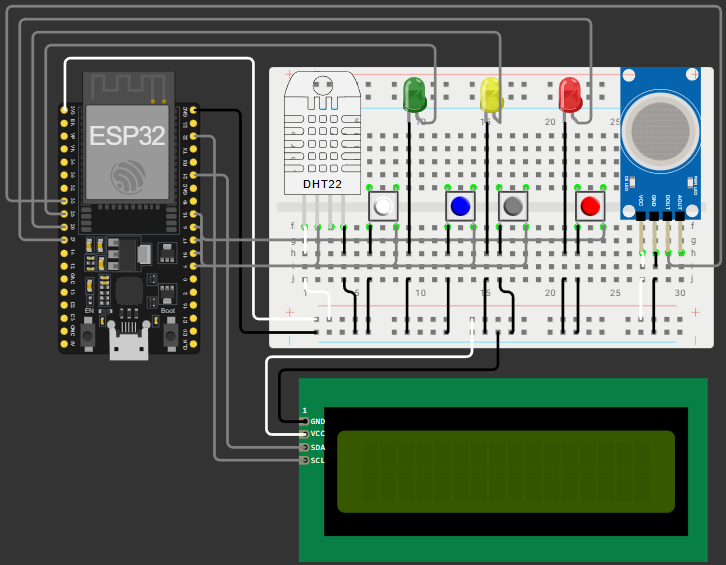

# 🚀 HELIOS IoT - Sistema Inteligente de Monitoramento de Habitat Espacial

## 📖 Sobre o Projeto

O **HELIOS IoT** é um sistema de monitoramento e gerenciamento de habitats espaciais desenvolvido como parte do projeto acadêmico de arquitetura corporativa, Internet das Coisas (IoT) e desenvolvimento de software.

A solução simula o funcionamento de um habitat extraterrestre localizado na Lua ou em Marte, monitorando variáveis ambientais essenciais para a sobrevivência dos ocupantes, como temperatura, qualidade do ar, radiação e condições operacionais.

O sistema utiliza um **ESP32** como controlador principal, responsável pela leitura dos sensores, exibição das informações em um display LCD, acionamento de indicadores visuais através de LEDs e disponibilização dos dados por meio de um servidor web embarcado.

---

# 🎯 Objetivos

- Monitorar condições ambientais do habitat.
- Classificar o nível de risco operacional.
- Disponibilizar informações em tempo real via navegador.
- Simular ambientes espaciais utilizando dados externos e sensores físicos.
- Servir como protótipo para futuras integrações com aplicações mobile e backend corporativo.

---

# 🏗️ Arquitetura da Solução

## Hardware

- ESP32
- Sensor DHT22
- Sensor MQ2
- Display LCD I2C 16x2
- LEDs indicadores
- Botões de navegação

## Software

- Arduino Framework
- ESP32 WiFi
- Web Server
- API Open-Meteo
- ArduinoJson
- Wokwi Simulator

---

# 🖼️ Preview do Projeto



---

# 🎥 Vídeo Demonstrativo

Assista à demonstração completa do projeto no YouTube:

🔗 https://youtu.be/qVPOrmbRgM4

---

# 🔌 Componentes Utilizados

| Componente | Função |
|------------|---------|
| ESP32 | Controlador principal |
| DHT22 | Monitoramento de temperatura e umidade |
| MQ2 | Detecção de gases |
| LCD I2C | Exibição local dos dados |
| LED Verde | Status Seguro |
| LED Amarelo | Status Atenção |
| LED Vermelho | Status Crítico |
| Botões | Navegação entre telas |
| WiFi | Comunicação com APIs e Dashboard |

---

# 📍 Mapeamento dos Pinos

## Sensores

| Componente | GPIO |
|------------|------|
| DHT22 | 4 |
| MQ2 | 33 |

## LEDs

| Componente | GPIO |
|------------|------|
| LED Verde | 25 |
| LED Amarelo | 26 |
| LED Vermelho | 27 |

## Botões

| Componente | GPIO |
|------------|------|
| Habitat | 15 |
| Terra | 17 |
| Lua | 5 |
| Marte | 18 |

## LCD I2C

| Sinal | GPIO |
|--------|------|
| SDA | 21 |
| SCL | 22 |

---

# 🌎 Dados Monitorados

## Habitat

- Temperatura
- Umidade
- Nível de gás
- Status operacional

## Terra

Dados obtidos através da API Open-Meteo:

- Temperatura
- Umidade
- Velocidade do vento

## Lua

Dados simulados:

- Temperatura média
- Radiação
- Gravidade

## Marte

Dados simulados:

- Temperatura
- Pressão atmosférica
- Velocidade do vento

---

# 🚦 Classificação de Risco

O sistema calcula automaticamente um nível de risco operacional.

| Status | Descrição |
|----------|------------|
| 🟢 Seguro | Condições normais de operação |
| 🟡 Atenção | Condições próximas aos limites operacionais |
| 🔴 Crítico | Condições que exigem ação imediata |

Os LEDs indicam visualmente o estado atual da tela selecionada.

---

# 🖥️ Interface LCD

O display LCD permite visualizar informações locais através dos botões físicos.

### Botão Branco (Habitat)

Exibe:

- Temperatura
- Status operacional

### Botão Azul (Terra)

Exibe:

- Temperatura da Terra
- Status operacional

### Botão Cinza (Lua)

Exibe:

- Temperatura da Lua
- Status operacional

### Botão Vermelho (Marte)

Exibe:

- Temperatura de Marte
- Status operacional

---

# 🌐 Dashboard Web

O ESP32 disponibiliza uma interface web acessível através do endereço IP gerado na conexão WiFi.

## Página Principal

```http
/
```

Exibe:

- Dados do Habitat
- Dados da Terra
- Dados da Lua
- Dados de Marte

---

## Status dos Sensores

```http
/status-sensores
```

Exemplo:

```json
{
  "temperatura": 25.4,
  "umidade": 60.0,
  "gas": 850,
  "status": "SEGURO"
}
```

---

## Status da Terra

```http
/status-terra
```

Exemplo:

```json
{
  "temperatura": 22.4,
  "umidade": 70.0,
  "vento": 12.3,
  "status": "SEGURO"
}
```

---

## Status da Lua

```http
/status-lua
```

Exemplo:

```json
{
  "temperatura": -53,
  "radiação": 8.7,
  "gravidade": 1.62,
  "status": "ATENÇÃO"
}
```

---

## Status de Marte

```http
/status-marte
```

Exemplo:

```json
{
  "temperatura": -45,
  "pressao": 720,
  "vento": 18,
  "status": "ATENCAO"
}
```

---

# 🔄 Fluxo de Funcionamento

1. O ESP32 inicializa os sensores.
2. Realiza conexão com a rede WiFi.
3. Obtém dados externos da Terra através da API Open-Meteo.
4. Realiza a leitura dos sensores locais.
5. Calcula os níveis de risco.
6. Atualiza LEDs e LCD.
7. Disponibiliza os dados através do servidor web.
8. Aguarda interação dos usuários pelos botões físicos.

---

# 🧪 Simulação no Wokwi

O projeto foi desenvolvido e validado utilizando a plataforma Wokwi.

Funcionalidades simuladas:

- ESP32
- DHT22
- MQ2
- LCD I2C
- LEDs
- Botões
- Servidor Web

---

# 📚 Tecnologias Utilizadas

- C++
- ESP32
- Arduino Framework
- WiFi
- HTTP
- JSON
- Open-Meteo API
- Wokwi
- GitHub

---

# 🧪 Simulação no Wokwi

🔗 https://wokwi.com/projects/465304103078621185

---

# 💻 Repositório GitHub

🔗 https://github.com/ZeDio/Global_Solution_IOT

---

# 👨‍💻 Equipe

Projeto desenvolvido por:

- José Diogo - ZeDio
🔗 https://github.com/ZeDio

- Arthur Dos Santos - Arth.pv
🔗 https://github.com/ArthurCPV

- Mariana Xavier - Marixavq
🔗 https://github.com/Marixavq

- Júlia Tiziotto - JúliaB
🔗 https://github.com/JuliaTButtler

- Bruno Martins - Taikawaititi
🔗 https://github.com/Taikawaititi

---

# 👨‍🚀 Projeto HELIOS

Sistema Inteligente de Monitoramento para Habitats Espaciais.